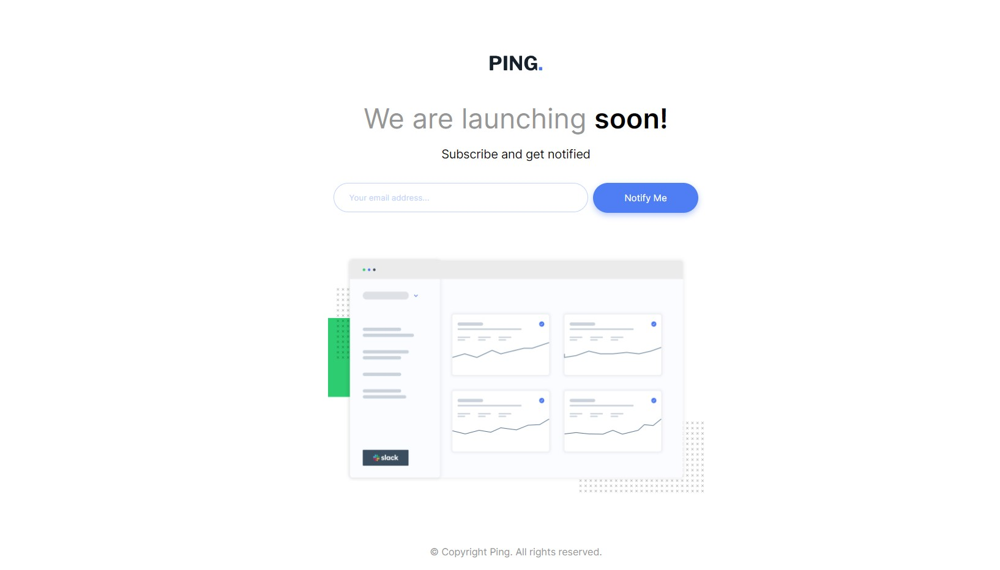
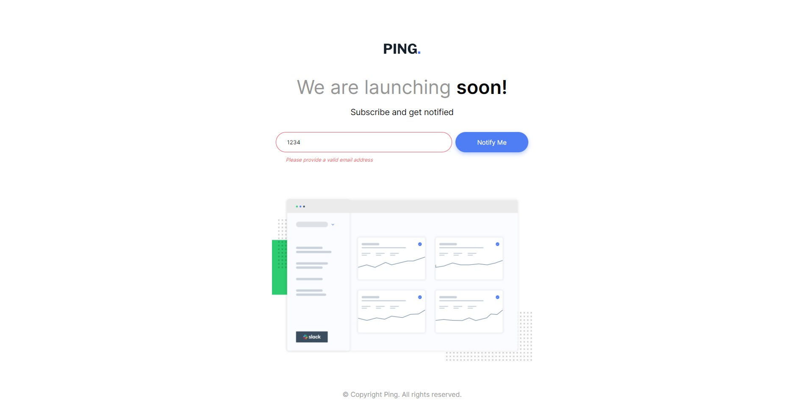
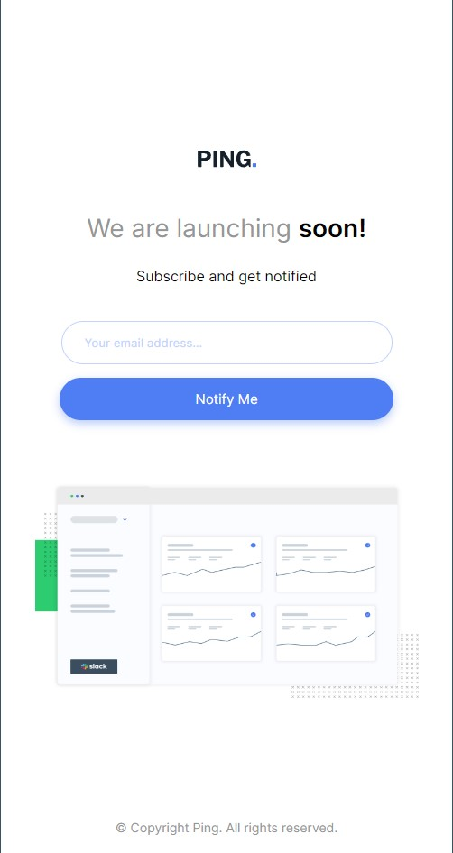
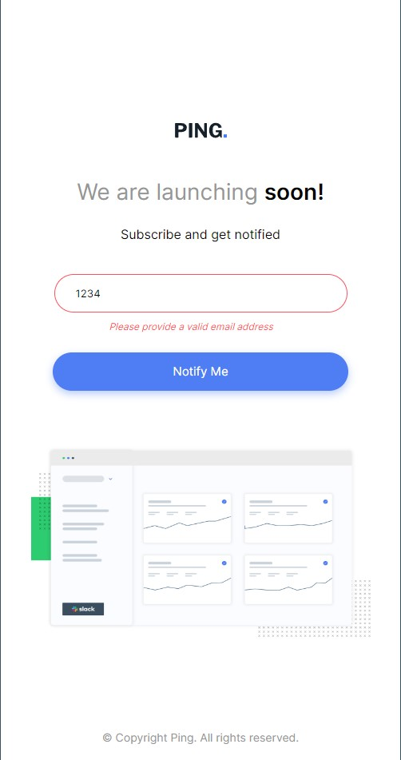

# Frontend Mentor - Ping coming soon page solution

This is a solution to the [Ping coming soon page challenge on Frontend Mentor](https://www.frontendmentor.io/challenges/ping-single-column-coming-soon-page-5cadd051fec04111f7b848da). Frontend Mentor challenges help you improve your coding skills by building realistic projects.

## Table of contents

- [Overview](#overview)
  - [The challenge](#the-challenge)
  - [Screenshot](#screenshot)
  - [Links](#links)
  - [Built with](#built-with)
- [Author](#author)

## Overview

The goal of this project is to try to recreate the design for the webpage, including its interactive elements, as close to the original as possible (provided in the design folder). This challenge was provided by Frontend Mentor as a way to practice your skills and improve them. A screenshot of what the end result should look like is at the top of this file. In the screenshot section below you may find the authors own attempt at emulating the design. As both a desktop version as well as a mobile responsive version when the screen size is minimized.

### The challenge

Users should be able to:

- View the optimal layout for the site depending on their device's screen size
- See hover states for all interactive elements on the page
- Submit their email address using an `input` field
- Receive an error message when the `form` is submitted if:
  - The `input` field is empty. The message for this error should say *"Whoops! It looks like you forgot to add your email"*
  - The email address is not formatted correctly (i.e. a correct email address should have this structure: `name@host.tld`). The message for this error should say *"Please provide a valid email address"*

### Screenshot

### Links

- Solution URL: [Frontend Mentor](https://your-solution-url.com)
- Live Site URL: [Github](https://your-live-site-url.com)

### Built with

- HTML
- CSS
- JavaScript

## Author

- Github - [Bryan Suarez](https://www.github.com/FriedAxons)
- Frontend Mentor - [@FriedAxons](https://www.frontendmentor.io/profile/FriedAxons)
